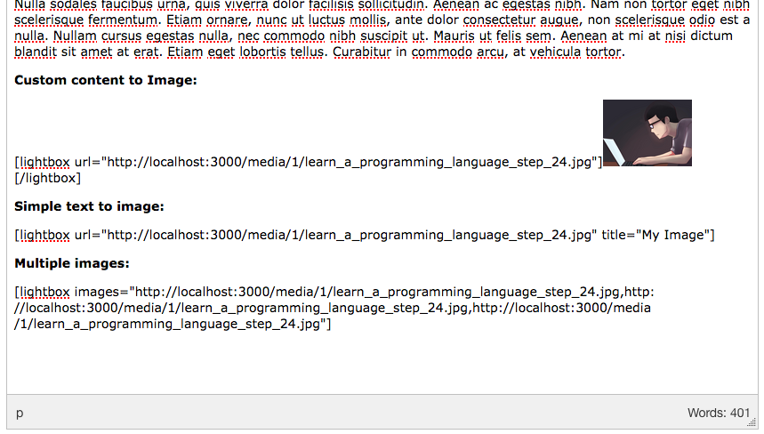
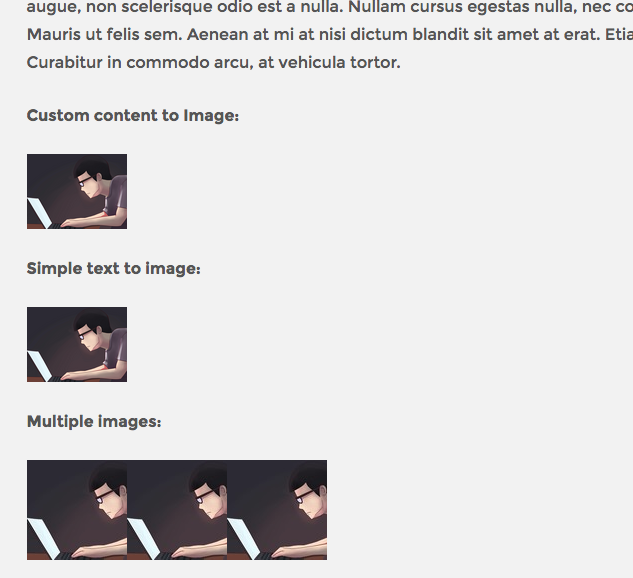

# CamaImageLightbox
Camaleon CMS Plugin to show Images in Lightbox





## Installation
* Add this line to your application's Gemfile:
```ruby
gem 'cama_image_lightbox'
```
* Execute bash
```
bundle
```
* Go to admin -> plugins -> activate plugin
* Edit any content and use shortcodes like
    - Custom content to Image: 
    ```
    [lightbox url="http://localhost:3000/media/1/learn_a_programming_language_step_24.jpg"][/lightbox]
    ```
    - Imple text to image:
    ```
      [lightbox url="http://localhost:3000/media/1/learn_a_programming_language_step_24.jpg" title="My Image"]
    ```  
    - Multiple images: Thumbnail is used the thumb generated by camalaeon cms on uploader
    ```
      [lightbox images="http://localhost:3000/media/1/learn_a_programming_language_step_24.jpg,http://localhost:3000/media/1/learn_a_programming_language_step_24.jpg,http://localhost:3000/media/1/learn_a_programming_language_step_24.jpg"]
    ```

## License
The gem is available as open source under the terms of the [MIT License](http://opensource.org/licenses/MIT).
